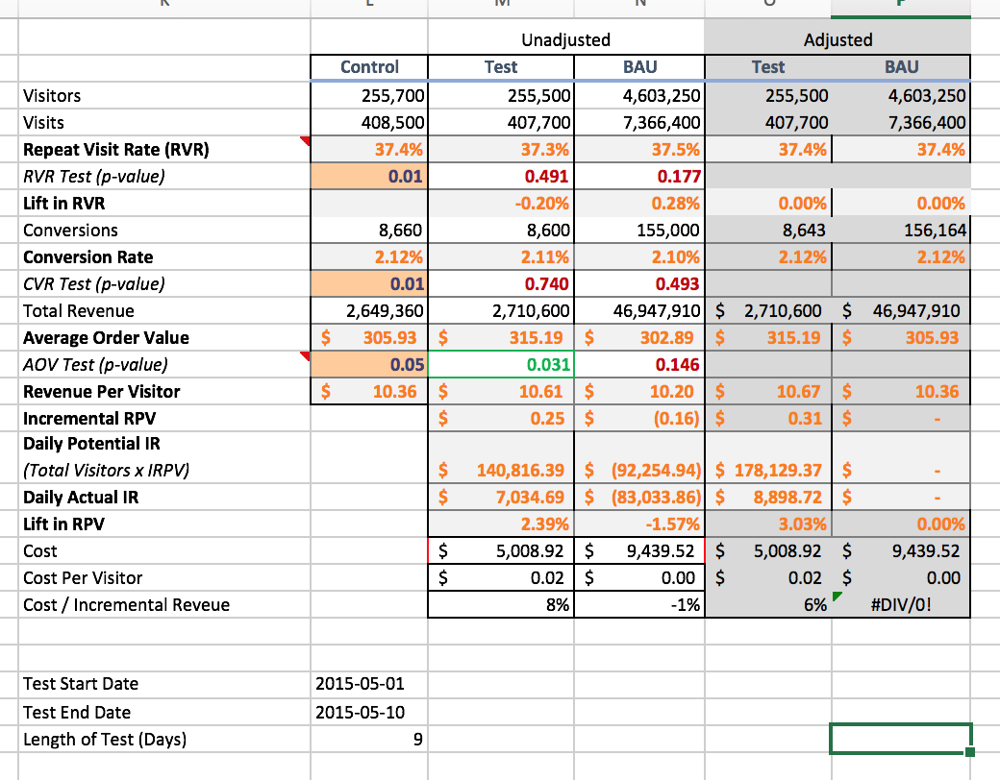

# Measuring Incremental Effects in E-commerce

During my testing process at work, I often have many test running simultaneously and business partners who want regular performance reports.  To improve efficiency and provide my business partners with autonomy I created an interactive excel sheet wherein a macro is connected to a python script using the python package `xlwings`.  To use the sheet, I first insert the relevant testing dates and test groups into the excel sheet as shown here:


After the cells outlined in the red box are updated, I just have to press the macro button `get incrementality!` to run the python script and produce the report.  The macro connects to a VBA module called `RunPython()` which allows me to connect to python.  Within python, the cells' values are then read using:


```python
import pyodbc
import xlwings as xw
from pandas.io import sql
import pandas as pd

#connect to excel book
wb = xw.Book('U:\\incremental_test.xlsm')
sht = wb.sheets['incremental']

def groups(cell):
    group=sht.range(cell).value
    return group

initials = sht.range('B1').value
test = list()
bau = list()
control = list()
for i in range(1,21):
    cell = 'B{}'.format(i+5)
    resp = 'A{}'.format(i+5)
    group = groups(cell)
    if group=='TEST':
        test.append('\'{}\''.format(groups(resp)))
    elif group=='CONTROL':
        control.append('\'{}\''.format(groups(resp)))
    else:
        bau.append('\'{}\''.format(groups(resp)))
startdate = sht.range('B3').value
enddate = sht.range('B4').value
```

Once the values have been stored in python I use them to dynamically modify a SQL script and query the database.


```python
def update_query(initials,startdate,enddate,list1,list2,list3):
    if list1:
        bau_template='''SELECT
  COUNT(DISTINCT visits) AS visits
  , COUNT(DISTINCT visitors) AS visitors
  , SUM(conversions) AS conversions
  , SUM(totalrevenue) AS revenue
  , AVG(CASE
  	WHEN totalrevenue > 0 THEN LN(totalrevenue)
  	ELSE NULL
  	END) AS avg_rev
  , STDDEV_POP(CASE
  	WHEN totalrevenue > 0 THEN LN(totalrevenue)
  	ELSE NULL
  	END) AS sd_rev
FROM tmpTable
WHERE testgroupname in ({test_group1})
''' 
    if list2:
        test_template = '''SELECT
  COUNT(DISTINCT visits) AS visits
  , COUNT(DISTINCT visitors) AS visitors
  , SUM(conversions) AS conversions
  , SUM(totalrevenue) AS revenue
  , AVG(CASE
  	WHEN totalrevenue > 0 THEN LN(totalrevenue)
  	ELSE NULL
  	END) AS avg_rev
  , STDDEV_POP(CASE
  	WHEN totalrevenue > 0 THEN LN(totalrevenue)
  	ELSE NULL
  	END) AS sd_rev
FROM tmpTable
WHERE testgroupname in ({test_group2})
''' 
    if list3:
        control_template='''SELECT
  COUNT(DISTINCT visits) AS visits
  , COUNT(DISTINCT visitors) AS visitors
  , SUM(conversions) AS conversions
  , SUM(totalrevenue) AS revenue
  , AVG(CASE
  	WHEN totalrevenue > 0 THEN LN(totalrevenue)
  	ELSE NULL
  	END) AS avg_rev
  , STDDEV_POP(CASE
  	WHEN totalrevenue > 0 THEN LN(totalrevenue)
  	ELSE NULL
  	END) AS sd_rev
FROM tmpTable
WHERE testgroupname in ({test_group3})
''' 

    x1=','.join(list1)
    x2=','.join(list2)
    x3=','.join(list3)
    update_bau=""
    update_test=""
    update_control=""
    if list1:
        update_bau = bau_template.format(test_group1=x1)
    if list2:
        update_test = test_template.format(test_group2=x2)
    if list3:
        update_control = control_template.format(test_group3=x3)

    return update_template,update_bau,update_test,update_control

def main():
    query,select_bau,select_test,select_control=update_query(initials,startdate,enddate,bau,test,control)
    #execute query in vertica
    cursor=vertica.cursor()
    cursor.execute(query)
    df_bau=pd.DataFrame()
    df_test=pd.DataFrame()
    df_control=pd.DataFrame()
    
    #insert values into excel sheet
    if select_bau:
        df_bau = sql.read_sql(select_bau,vertica)
        sht.range('B30').options(index=False,header=False).value=df_bau
    if select_test:
        df_test = sql.read_sql(select_test,vertica)
        sht.range('B31').options(index=False,header=False).value=df_test
    if select_control:
        df_control = sql.read_sql(select_control,vertica)
        sht.range('B32').options(index=False,header=False).value=df_control

if __name__ == "__main__":
    main()
```

Finally, the values that are reinserted into the excel sheet are used to evaluate the performance different models.  The sheet calculates each of the most important e-commerce KPIs which are:

* `Repeat Visit Rate (RVR)`: the proportion of visitors who make more than one visit.
* `Conversion Rate`: the proportion of visitors who convert in the same visit.
* `Average Order Value (AOV)`: the total revene divided by total orders

Because there is a control group that is without treatment, we can test each KPI to determine whether or not it's significantly different from the control group.  For both repeat visit rate and conversion rate I use a chi-squared test, and for average order value I use a t-test.  The `adjusted` column of the sheet is then set to evaluate whether the p-value from each of those tests is lower than the alpha value we set. Only when the difference is statistically significant do I replace the control value with the test group values.  In the example below, the `test` column has an AOV that is different from control at a statistically significant level so the `test`AOV value is carried over to `adjusted` column.  Conversely the `BAU` AOV is not significant so the control value is used in the `adjusted` column. 


Finally, I am left with the Cost / Incremental Revenue, which is representative of return on investment.  This sheet empowers non-technical business analysts to monitor modeling performance without having to query the database and calculate the KPIs themselves, saving roughly half an hour of effort each time a report is requested.
